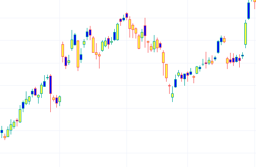
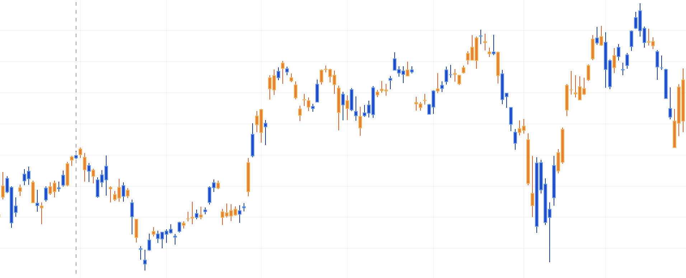

## :warning: WARNING :warning:

### Our documentation has moved to a [new site](https://www.tradingview.com/charting-library-docs/)

You can find the corresponding page here: [Custom Studies Examples
](https://www.tradingview.com/charting-library-docs/latest/custom_studies/Custom-Studies-Examples)

---

<br/>
<br/>

Typescript equivalents for these examples are available here: [Custom Studies Typescript Examples](Custom-Studies-Typescript-Examples).

## Requesting data for another ticker

```javascript
custom_indicators_getter: function(PineJS) {
    return Promise.resolve([
        {
            name: 'Equity',
            metainfo: {
                _metainfoVersion: 51,
                id: 'Equity@tv-basicstudies-1',
                description: 'Equity',
                shortDescription: 'Equity',
                is_hidden_study: true,
                is_price_study: true,
                isCustomIndicator: true,
                format: {
                    type: 'price',
                    // Precision is set to one digit, e.g. 777.7
                    precision: 1,
        },

                plots: [{id: 'plot_0', type: 'line'}],
                defaults: {
                    styles: {
                        plot_0: {
                            linestyle: 0,
                            visible: true,

                            // Make the line thinner
                            linewidth: 1,

                            // Plot type is Line
                            plottype: 2,

                            // Show price line
                            trackPrice: true,

                            // Set the plotted line color to dark red
                            color: '#880000'
                        }
                    },

                    inputs: {}
                },
                styles: {
                    plot_0: {
                        // Output name will be displayed in the Style window
                        title: 'Equity value',
                        histogramBase: 0,
                    }
                },
                inputs: [],
            },

            constructor: function() {
                this.init = function(context, inputCallback) {
                    this._context = context;
                    this._input = inputCallback;

                    var symbol = '#EQUITY';
                    this._context.new_sym(symbol, PineJS.Std.period(this._context));
                };

                this.main = function(context, inputCallback) {
                    this._context = context;
                    this._input = inputCallback;

                    this._context.select_sym(1);

                    var v = PineJS.Std.close(this._context);
                    return [v];
                }
            }
        }
    ]);
},
```

## Coloring bars



```javascript
{
    name: 'Bar Colorer Demo',
    metainfo: {
        _metainfoVersion: 51,

        id: "BarColoring@tv-basicstudies-1",
        name: "BarColoring",
        description: "Bar Colorer Demo",
        shortDescription: "BarColoring",

        isCustomIndicator: true,
        isTVScript: false,
        isTVScriptStub: false,

        format: {
            type: 'price',
            precision: 4,
        },

        defaults: {
            palettes: {
                palette_0: {
                    // palette colors
                    // change it to the default colors that you prefer,
                    // but note that the user can change them in the Style tab
                    // of indicator properties
                    colors: [
                        { color: '#FFFF00' },
                        { color: '#0000FF' }
                    ]
                }
            }
        },
        inputs: [],
        plots: [{
            id: 'plot_0',

            // plot type should be set to 'bar_colorer'
            type: 'bar_colorer',

            // this is the name of the palette that is defined
            // in 'palettes' and 'defaults.palettes' sections
            palette: 'palette_0'
        }],
        palettes: {
            palette_0: {
                colors: [
                    { name: 'Color 0' },
                    { name: 'Color 1' }
                ],

                // the mapping between the values that
                // are returned by the script and palette colors
                valToIndex: {
                    100: 0,
                    200: 1
                }
            }
        }
    },
    constructor: function() {
        this.main = function(context, input) {
            this._context = context;
            this._input = input;

            var valueForColor0 = 100;
            var valueForColor1 = 200;

            // perform your calculations here and return one of the constants
            // that is specified as a key in 'valToIndex' mapping
            var result =
                Math.random() * 100 % 2 > 1 ? // we randomly select one of the color values
                    valueForColor0 : valueForColor1;

            return [result];
        }
    }
}
```

## Custom styles for every point


```javascript
{
    name: 'Equity',
    metainfo: {
        _metainfoVersion: 51,
        id: 'Equity@tv-basicstudies-1',
        scriptIdPart: '',
        description: 'Equity',
        shortDescription: 'Equity',
        is_hidden_study: false,
        is_price_study: false,
        isCustomIndicator: true,
        plots: [
            {
                'id': 'plot_0',
                'type': 'line',
            },
            {
                'id': 'plot_1',
                'type': 'colorer',
                'target': 'plot_0',
                'palette': 'paletteId1',
            },
        ],
        palettes: {
            paletteId1: {
                colors: {
                    0: {
                            name: 'First color',
                    },
                    1: {
                            name: 'Second color',
                    },
                },
            },
        },
        defaults: {
            palettes: {
                paletteId1: {
                    colors: {
                        0: {
                            color: 'red',
                            width: 1,
                            style: 0,
                        },
                        1: {
                            color: 'blue',
                            width: 3,
                            style: 1,
                        },
                    },
                },
            },
            styles: {},
            precision: 4,
            inputs: {},
        },
        styles: {
            plot_0: {
                title: 'Equity value',
                histogramBase: 0,
            },
        },
        inputs: [],
        format: {
            type: 'price',
            precision: 4,
        },
    },
    constructor: function() {
        this.main = function(context, inputCallback) {
            this._context = context;
            this._input = inputCallback;

            var value = Math.random() * 200;

            return [value, value > 100 ? 0 : 1];
        }
    }
}
```

## Complex filled areas


```javascript
{
    name: 'Equity',
    metainfo: {
        _metainfoVersion: 51,
        id: 'Equity@tv-basicstudies-1',
        scriptIdPart: '',
        description: 'Equity',
        shortDescription: 'Equity',
        is_hidden_study: false,
        is_price_study: false,
        isCustomIndicator: true,
        plots: [
            {
                id: 'plot_0',
                type: 'line',
            },
            {
                id: 'plot_1',
                type: 'line',
            },
            {
                id: 'plot_2',
                type: 'colorer',
                target: 'filledAreaId1',
                palette: 'paletteId1',
            },
        ],

        filledAreas: [
            {
                id: 'filledAreaId1',
                objAId: 'plot_0',
                objBId: 'plot_1',
                title: 'Filled area between first and second plot',
                type: 'plot_plot',
                palette: 'paletteId1',
            },
        ],

        palettes: {
            paletteId1: {
                valToIndex: {
                    0: 0,
                    1: 1,
                },
                colors: {
                    0: {
                        name: 'First color',
                    },
                    1: {
                        name: 'Second color',
                    },
                },
            },
        },
        defaults: {
            filledAreasStyle: {
                filledAreaId1: {
                    color: 'yellow',
                    visible: true,
                    transparency: 40,
                },
            },

            palettes: {
                paletteId1: {
                    colors: {
                        0: {
                            color: 'red',
                            width: 1,
                            style: 0,
                        },
                        1: {
                            color: 'blue',
                            width: 3,
                            style: 1,
                        },
                    },
                },
            },

            styles:
            {
                plot_0: {
                    linestyle: 0,
                    visible: true,
                    linewidth: 1,
                    plottype: 2,
                    trackPrice: true,
                    color: 'blue'
                },
                plot_1: {
                    linestyle: 1,
                    visible: true,
                    linewidth: 2,
                    plottype: 2,
                    trackPrice: true,
                    color: 'red'
                },
            },
            precision: 4,
            inputs: {}
        },
        styles:
        {
            plot_0:
            {
                title: 'First plot',
                histogramBase: 0,
            },
            plot_1:
            {
                title: 'Second plot',
                histogramBase: 0,
            },
        },
        inputs: [],
        format: {
            type: 'price',
            precision: 4,
        },
    },
    constructor: function() {
        this.main = function(context, inputCallback) {
            this._context = context;
            this._input = inputCallback;

            var value = Math.random() * 200 - 100;
            var colorIndex = value > 0 ? 0 : 1;

            return [0, value, colorIndex];
        }
    }
}
```

## Advanced Shapes use


```javascript
{
    name: 'fxn',
    metainfo: {
        _metainfoVersion: 51,
        isTVScript: false,
        isTVScriptStub: false,
        is_hidden_study: false,
        defaults: {
            styles: {
                plot_0: {
                  color: '#FF5252',
                  textColor: '#2196F3',
                  visible: true
                }
            },
            inputs: {}
        },
        plots: [
            {
                id: 'plot_0',
                type: 'shapes'
            }
        ],
        styles: {
            plot_0: {
              isHidden: false,
              location: 'Bottom',
              plottype: 'shape_circle',
              size: 'tiny',
              text: 'Monday',
              title: 'Shapes'
            }
        },
        description: 'fxn',
        shortDescription: 'fxn',
        is_price_study: false,
        inputs: [],
        id: 'fxn@tv-basicstudies-1',
        scriptIdPart: '',
        format: {
            type: 'inherit',
        },
    },
    constructor: function() {
        this.main = function(context, inputCallback) {
            var studyValue = Math.random() * 100 - 50;
            var shouldBeShapeVisible = studyValue > 0;

            // 1 is plot value, it'll be displayed in legend of the indicator
            // NaN means that there is no value for that plot and shape should be hidden for that bar
            var plotValue = shouldBeShapeVisible ? 1 : NaN;
            return [plotValue];
        }
    }
},
```

## Advanced Colouring Candles



```javascript
{
    name: 'Colouring Candles',
    metainfo: {
        _metainfoVersion: 51,

        id: 'colouringcandles@tv-basicstudies-1',
        name: 'Colouring Candles',
        description: 'Colouring Candles',
        shortDescription: 'Colouring Candles',

        isCustomIndicator: true,
        isTVScript: false,
        isTVScriptStub: false,

        is_price_study: false, // whether the study should appear on the main series pane.
        linkedToSeries: true, // whether the study price scale should be the same as the main series one.

        format: {
            type: 'price',
            precision: 2,
        },

        plots: [
            {
                id: 'plot_open',
                type: 'ohlc_open',
                target: 'plot_candle',
            },
            {
                id: 'plot_high',
                type: 'ohlc_high',
                target: 'plot_candle',
            },
            {
                id: 'plot_low',
                type: 'ohlc_low',
                target: 'plot_candle',
            },
            {
                id: 'plot_close',
                type: 'ohlc_close',
                target: 'plot_candle',
            },
            {
                id: 'plot_bar_color',
                type: 'ohlc_colorer',
                palette: 'palette_bar',
                target: 'plot_candle',
            },
            {
                id: 'plot_wick_color',
                type: 'wick_colorer',
                palette: 'palette_wick',
                target: 'plot_candle',
            },
            {
                id: 'plot_border_color',
                type: 'border_colorer',
                palette: 'palette_border',
                target: 'plot_candle',
            },
        ],

        palettes: {
            palette_bar: {
                colors: [{ name: 'Colour One' }, { name: 'Colour Two' }],

                valToIndex: {
                    0: 0,
                    1: 1,
                },
            },
            palette_wick: {
                colors: [{ name: 'Colour One' }, { name: 'Colour Two' }],

                valToIndex: {
                    0: 0,
                    1: 1,
                },
            },
            palette_border: {
                colors: [{ name: 'Colour One' }, { name: 'Colour Two' }],

                valToIndex: {
                    0: 0,
                    1: 1,
                },
            },
        },

        ohlcPlots: {
            plot_candle: {
                title: 'Candles',
            },
        },

        defaults: {
            ohlcPlots: {
                plot_candle: {
                    borderColor: '#000000',
                    color: '#000000',
                    drawBorder: true,
                    drawWick: true,
                    plottype: 'ohlc_candles',
                    visible: true,
                    wickColor: '#000000',
                },
            },

            palettes: {
                palette_bar: {
                    colors: [
                        { color: '#1948CC', width: 1, style: 0 },
                        { color: '#F47D02', width: 1, style: 0 },
                    ],
                },
                palette_wick: {
                    colors: [
                        { color: '#0C3299', },
                        { color: '#E65000', },
                    ],
                },
                palette_border: {
                    colors: [
                        { color: '#5B9CF6', },
                        { color: '#FFB74D', },
                    ],
                },
            },

            precision: 2,
            inputs: {},
        },
        styles: {},
        inputs: [],
    },
    constructor: function () {
        this.main = function (context, inputCallback) {
            this._context = context;
            this._input = inputCallback;

            this._context.select_sym(0);

            var o = PineJS.Std.open(this._context);
            var h = PineJS.Std.high(this._context);
            var l = PineJS.Std.low(this._context);
            var c = PineJS.Std.close(this._context);

            // Color is determined randomly
            const colour = Math.round(Math.random());
            return [o, h, l, c, colour /*bar*/, colour /*wick*/, colour /*border*/];
        };
    },
},
```
